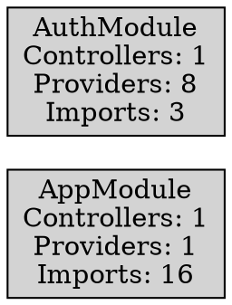

# NestJS Dependency Analyzer

A command-line tool for analyzing and visualizing dependencies in NestJS applications. This tool parses your NestJS modules and creates visual representations of their relationships, helping you understand the architecture of your application.

## Features

- 🔍 Analyzes NestJS module dependencies
- 📊 Generates dependency graphs in DOT format
- 🎨 Visualizes module relationships using Graphviz
- 📝 Outputs detailed module information in JSON format
- 🔄 Supports circular dependency detection
- 📦 Tracks imports, providers, and controllers

## Prerequisites

- Node.js (v14 or higher)
- npm or yarn
- Graphviz (optional, for visualization)

### Installing Graphviz

For generating visual graphs, you'll need to install Graphviz:

**Windows (using Chocolatey):**
```bash
choco install graphviz
```

**macOS (using Homebrew):**
```bash
brew install graphviz
```

**Ubuntu/Debian:**
```bash
sudo apt-get install graphviz
```

## Installation

```bash
# Clone the repository
git clone https://github.com/ChuloWay/nestjs-dependency-analyzer.git

# Install dependencies
cd nestjs-dependency-analyzer
npm install

# Build the project
npm run build

# Link globally (optional)
npm link
```

## Usage

### Basic Command

```bash
npm run analyze -- [options]
```

### Options

```
Options:
  -p, --path <path>      Project path (default: current directory)
  -f, --format <format>  Output format (json|dot) (default: "json")
  -d, --depth <depth>    Dependency resolution depth (default: "2")
  -o, --output <output>  Output file path
  -h, --help            Display help information
```

### Examples

1. Analyze current directory and output JSON:
```bash
npm run analyze
```

2. Analyze specific project and generate DOT visualization:
```bash
npm run analyze -- -p ../my-nestjs-project -f dot -o dependencies.dot
```

3. Generate visualization PNG:
```bash
npm run analyze -- -p ../my-nestjs-project -f dot -o ./output/dependencies.dot
```

The tool will automatically attempt to generate a PNG file if Graphviz is installed.

## Output Formats

### DOT Format
Generates a DOT file that can be visualized using Graphviz. The output includes:
- Module nodes with details (controllers, providers, imports)
- Import relationships between modules
- Provider dependency relationships

Example:


### JSON Format
Provides detailed information about each module including:
- Module name and file path
- List of imports with their metadata
- Providers with dependency information
- Controllers count
- Export information

## Module Analysis

The analyzer examines:
- `@Module()` decorators
- Import declarations
- Provider dependencies
- Controller registrations
- Circular dependencies
- Injectable services
- Module exports

## Development

### Project Structure

```
nestjs-dependency-analyzer/
├── src/
│   ├── analyzers/
│   │   └── dependency.analyzer.ts
│   ├── parsers/
│   │   └── ast.parser.ts
│   ├── visualizers/
│   │   └── dot.visualizer.ts
│   ├── types/
│   │   └── modules.types.ts
│   |── cli/commands/
│   |    └── analyze.command.ts
|   |── main.ts
├── tests/
└── package.json
```

<!-- ### Running Tests

```bash
npm test
``` -->

### Building

```bash
npm run build
```

## Contributing

1. Fork the repository
2. Create your feature branch (`git checkout -b feature/amazing-feature`)
3. Commit your changes (`git commit -m 'Add some amazing feature'`)
4. Push to the branch (`git push origin feature/amazing-feature`)
5. Open a Pull Request

## License

This project is licensed under the MIT License - see the [LICENSE](LICENSE) file for details.

## Acknowledgments

- NestJS team for their amazing framework
- Graphviz team for the visualization engine
- TypeScript team for the compiler API

## Support

For support, please create an issue in the GitHub repository or contact the maintainers.